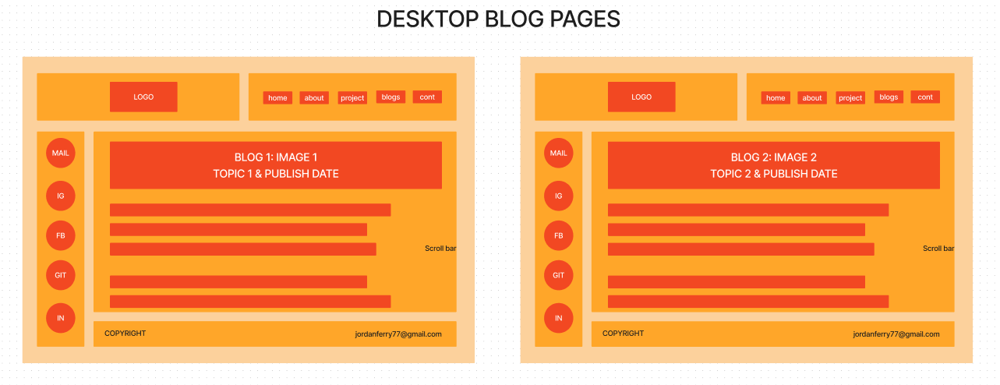
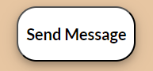

# Jordan Ferry T1A2 Portfolio

* [Ferry-J Github](https://github.com/Ferry-J/JordanFerry2_T1A2) 
* [Portfolio Website](https://jordanferryt1a2.netlify.app/)

## Overview & Purpose

My portfolio website is an online space which showcase my abilities and knowledge as a professional web developer to prospective employers. Here you will find blogs that I have written and published with additional access to my social and professional accounts. You will also learn a little bit about my personal interests, as well as the current study path I am undertaking. 

## Tech Stack

My portfolio website was made with HTML and CSS, deployed via the Netlify online platform.

## Sitemap

The website has been structured in a way that accessibility to the main pages of interest are immediate with no extra steps. This is shown by how the homepage has clear connection to the navigation pages of "About", "Blogs" and "Contact". Similarly, immediate access to external links can also be retrieved from the homepage. These externals links are various social media platforms like Instagram and Facebook, as well as mail and professional accounts, Github and Linkedin.

In the "About" navigation page, an external link to a resume can be accessed. This resume is opened within a new tab of the browser.

In the "Blogs" navigation page, there are six different blog webpages that can be accessed. These webpages cannot navigate between one another and must return to the main navigation page of "Blogs" if a user wishes to read about a different topic. 

The "Contact" navigation page does not connect to any new webpages or external links.

It is important to note that the **hierarchal** nature of this sitemap omits some access points such as:

* Although it is only shown that the homepage has access to the external social and professional links, these links can actually be accessed at any given point in the portfolio.

*  The user does not have to return to the homepage to access a different navigation page, it is possible to navigate between them directly. 

*  The homepage has immediate and direct access to the first three blogs of the portfolio.

## Wireframes

### Desktop: Home & Default

Regarding the design of my portfolio, I wished for it be simple and compact. My aim was to have all necessary sections mostly shown within the entire screen with minimal scrolling. The aesthetic I was after was that of a cafe. I plan to have many differing tones of brown with a mix of black and white text throughout akin to milk and coffee. 

The logo and nav sections are positioned side by side at the top of screen. 

The navigation bar is at the right side of screen with five buttons. It was designed to be separate from the logo so that it feels more compact, conforming with the design brief. Similarly, the logo is separate to create a more clear distinction from itself and other elements, this helps the logo to stand out. 

On the left-hand side of the screen is the sidebar section. The sidebar extends down and positions itself next to the footer but does not extend past the logo or nav bar. The sidebar contains five external links to various platforms. Rather than text being used, the links will be replaced by an image of the associated platform. The sidebar was designed to be underneath the logo and nav so that it is more closely associated with the main and content sections. However, it positions itself next to the footer as to not make the website feel too enclosed and claustrophobic. 

On the bottom of the screen is the footer. The footer extends through its entire x-axis but does not extend past the sidebar. Its height is the smallest of all sections with the copyright and written email on either ends. These design choices for the footer help it to not pull focus away from the more interesting elements of the homepage. 

In between the footer and the top sections, we have the content and main sections. 

The main section is positioned above the content and extends fully in the x-axis but does not extend past the sidebar. The main section will house a profile image of myself and a bit of text positioned to the right of it. This helps to convey the feeling of being greeted upon as if one were to enter an actual cafe in real life. This is further expanded upon as the text will welcome the user as well as provide a brief and personal introduction about myself. 

At the bottom of the main section is the content section. It also extends fully in the x-axis but does not extend past the sidebar. The content section will house three blog webpages side by side. The decision to include sample blogs in the homepage is to immediately introduce to the user some of the "products" this portfolio has to offer. The thought was akin to how cafes has their own menu from which a customer can choose to order from.

Changes will only occur to the the main and content sections when different pages are navigated in the desktop view. The content section will be omitted and fully taken up by the main section as will be seen in the upcoming wireframes.

### Mobile: Home & Default

Similarly to the default/home desktop view, the default/home mobile view is also simple and compact. All sections are shown within the entire screen with minimal to no scrolling needed to reach different elements.

The structure of the mobile view will see its sections positioned vertically. From top to bottom we have the logo, nav, sidebar, main, content and footer sections. I have decided to include a single grid column to increase compactability to conform with the design brief. This makes navigation for mobile view a lot simpler and easier. 

For the same reasons mentioned in the desktop view, the logo and nav sections have been separated. These sections become more distinct from one another helping their respective elements to stand out more.

The mobile view will see its sidebar shift horizontally. This is to keep sections compact and easy to distinguish. if it were to remain positioned vertically, two grid columns would have to be implemented, making the view seem more cluttered and confusing. 

The main and content sections remain mostly unchanged for the same reasons mentioned in the desktop view. The only difference here is that the content section will introduce a scroll bar/wheel so that the user may navigate to different sample blogs without having to scroll the entire page. 

The footer will see its contents now positioned vertically. This decision was made so that all sections conform with the single grid column structure, making it more compact. 

### Mobile & Desktop: About, Blogs & Contact

The desktop and mobile views for the About, Blogs and Contact webpages will see the logo, navigation bar, side bar and footer unchanged as mentioned above in the default desktop view. The only change made is that the main section has now taken up the content section. By only changing this aspect of the webpage when being navigated through, the user experience is made more simple and easier to understand. Users will know where the change in pages will occur and what to look out for when navigating.

### Mobile & Desktop: Blog Webpages

In the mobile and desktop views for the blog webpages, it now takes up the entire main section. The respective blog images, titles and publish dates have their containers stretched to fill most of the width of the main section. This provides clear distinction between the main topic and text. A scroll bar has also been introduced into this main section. This is so that the user does not have the scroll the entire page to continue reading the blog material maintaining the compact nature of the portfolio.

## Components, Styling, Features & Functionality

### Logo

The logo features my initials "JF" with an elegant font and swirly line ornament passing through the letters. The fancy design of this logo was made in mind to be akin to a cafe. The slightly beige background of the font and entirely dark brown parent container it is inside of help to convey this impression of a cafe even further. It also has a box shadow around the borders to give it more dimension. Additionally, the white text to the right of the logo was made to be akin to milk, an ingredient widely used to make coffee in cafes.

### Desktop Navigation Bar

The navigation bar has five links leading to different navigation pages of the portfolio. These links have been styled to have a white container and black text. These links have been coloured this way to conform with the cafe aesthetic, white for milk and a dark brown parent container akin to coffee. They also have a box shadow to provide dimension.

Users are engaged through the responsiveness of these links through transforms and colour changes. When hovered over, the links container becomes black, slightly increases in width and its text becomes white. Additionally, it also transforms by moving up the y-axis a few pixels. This helps users to clearly recognise the navigation link they are about to access when hovering over them. 

### Introduction & Greetings

The homepage's main section contains an image with an introduction and greeting text. The image is of an individual with a cheerful and happy expression. This gives users a positive atmosphere when first entering the portfolio. This atmosphere is further broadened with the use of text. The text displayed introduces the name of whom the portfolio is of as well a brief description of their role. The parent container's background colour is a different shade of brown unique to other sections of the homepage. This will help users distinguish between different sections and their elements. 

### Mobile Navigation Bar

The mobile navigation bar contain the same content of the desktop navigation bar and keep most of their stylistic choices and reasoning. The only difference here is that the links container has been omitted, therefore its box shadow has been omitted and text has been changed to white.

Users are engaged through the responsiveness of these links through transforms. When the navigation links are hovered over their text changes to black and transforms up on the y-axis by a few pixels. This helps users to clearly recognise the navigation link they are about to access when hovering over them. 

### Desktop & Mobile Side bar

The side bar has five external links which lead to various social and professional platforms. These links have been styled to omit text and simply display an image of their respective platform. This helps the user quickly recognise where these link displays will take them much faster than if it were text. Their link containers also have a box shadow which provide dimension. It is also important to note that the the links parent container has a different shade of brown to the navigation bar and logo containers. This is to provide distinction between sections yet still conform with the cafe aesthetic.

Users are engaged through the responsiveness of these links through transforms. When the link's containers are hovered over, they increase in size and moves a few pixels upwards on the y-axis. This helps users to clearly recognise the external link they are about to access when hovering over them.

### Footer

The footer contains a fake copyright label to its left side and written email on its right side. The copyright and email have white text enclosed within the dark brown background of its parent container conforming with the cafe aesthetic. It is important to note that this shade of dark brown is the same used for the logo and navigation bar containers. This is purposely done so that users recognise the starting and ending borders of the portfolio website.

Users are engaged through the responsiveness of this written email through text decorations. When the email is hovered over it is underlined to indicate that it is an external link and not just plain text. Users will know that if they wish to email a query that this is one of the options available to them. 

### Blogs: Main

The main section of the Blog's navigation page contains six different blog webpages that can be accessed. They have been styled to have dark brown containers for its topic and publish date surrounded by a beige parent container. These colour choices help to continue conforming with the cafe aesthetic. The links to access these blog webpages have deliberately been left underlined. This helps users to immediately recognise what they have to click in order to access a blog. 

### Blog Webpage: Main

The main section of a blog's webpage will see its image container stretch to fill the majority width of its parent container. By expanding its container, it is more noticeable and attention-grabbing. This decision was made in order to help users distinguish that they are now reading the contents of the blog they chose. 

Users have simple engagement with a returning link from the blog webpage. This link titled "Blogs" when hovered over becomes underlined. This is to help guests understand that this is a link which will return them to the "Blogs" navigation page if they wish to read about a different blog. 

### About: Resume

Users can engage with downloading the resume from the About's page through colour change. When hovered over, the background container of the resume link goes from white to a beige colour. This helps users develop a sense of responsiveness from the page. 

### Contact: Send Message

Users can engage with sending a message after filling in the submission form in the Contact's page. In similar fashion to the resume link as shown above, their stylistic choices are the same and done so for the same reasons. 

## P.S

My deepest apologies for the 4 days late submission. 

My family and I had actually been busy with moving into a new house when work for this assessment had begun. Financial stress overcame me as the only people currently working in my family are my mother and I. Many appointments to house inspections were done all through the month of May and many more shifts were picked up at work to fulfill financial needs for moving. 

At the time, it didn't occur to me that I could have requested for an assignment extension but im not really sure if this is even a valid reason for one. I've only just recently settled in after moving into the new house and was finally able to set up my PC for study. In any case, I would still like to apologise and will ensure future submissions are submitted on time. 

Kind regards,

Jordan Ferry